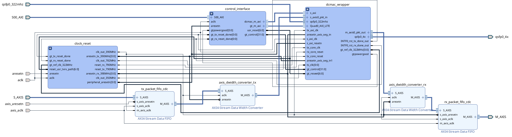
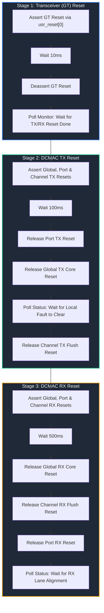
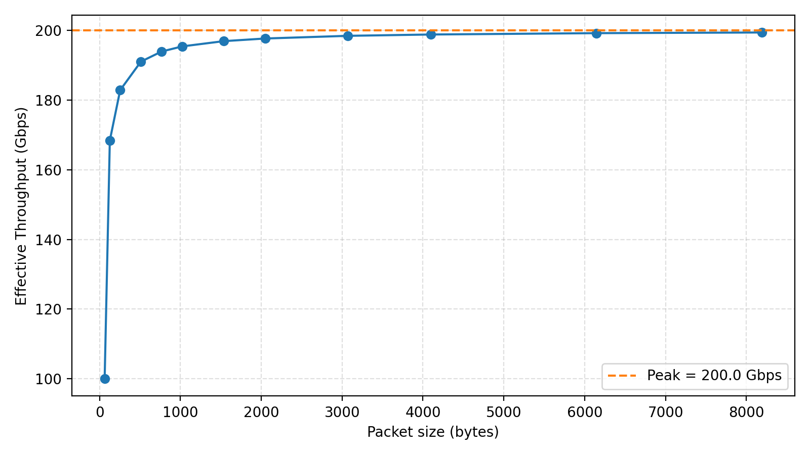

# 200G Ethernet on the V80

This document describes the 200 Gbps Ethernet capability using the AMD/Xilinx DCMAC IP block on the Alveo Versal V80 card.

> [!TIP]
> The hierarchical cells (`qsfp` and `qsfp1`) are designed to be self-contained. You can export this hierarchy from the block design and drop it directly into your own custom Vivado projects.

## Hardware Architecture

The 200 Gbps network pipeline integrates the high-performance AMD/Xilinx DCMAC IP block inside the block design hierarchal structure defined in [create_bd_design.tcl](./hardware/AVED/hw/amd_v80_gen5x8_25.1/src/bd/create_bd_design.tcl).



### QSFP Port Hierarchical Design (`qsfp` and `qsfp1`)
To support dual-channel 200G Ethernet, the block design defines two identical hierarchical cells: `qsfp` (representing Channel 0, QSFP Port 4) and `qsfp1` (representing Channel 1, QSFP Port 1). Each port hierarchy contains:
1. **DCMAC IP Wrapper (`dcmac_wrapper`)**: Encloses the MAC, PCS, and transceiver wizard subsystems.
2. **Clock and Reset Controller (`clock_reset`)**: Handles generation and domain crossing for internal clock domains.
3. **Control Interface (`control_interface`)**: Allows software control to the DCMAC/QSFP register interfaces and GPIO lines.

---

### Key IP Blocks and Configuration Settings
To recreate the 200 Gbps pipeline, the critical hardware IPs must be configured with the following properties in the Vivado Block Design:

#### 1. DCMAC Core (`dcmac` IP)
- **Location Constraints**: `DCMAC_X1Y1` (for `qsfp` / Channel 0) and `DCMAC_X0Y2` (for `qsfp1` / Channel 1)

<div style="font-size: 12px;">

| Vivado GUI Tab | Parameter / Field | Value / Configuration | Primary Tcl Parameter | Description |
| :--- | :--- | :--- | :--- | :--- |
| **Global Mode / Ports** | Enabled Ports | Only **Port 0** & **Port 1** enabled | - | Only the first two ports are used to support 200G. |
| **Configuration** | Port 0 Mode | `200GAUI-4` | `MAC_PORT0_CONFIG_C0` | PAM4 signaling across 4 physical lanes. |
| **GT Interface / Clocks** | GT Reference Clock Frequency | `322.265625 MHz` | `GT_REF_CLK_FREQ_C0` | Transceiver reference clock speed. |
| **MAC Configuration** | Port 0 & 1 RX Strip Preamble | Enabled (checked) | `MAC_PORT0_RX_STRIP_C0` / `MAC_PORT1_RX_STRIP_C0` | Strips preamble and SFD on receive. |
| **Implementation/Physical** | GT Pipeline Stages | `7` | `GT_PIPELINE_STAGES` | Sets timing pipeline stages. |

</div>

#### 2. Transceiver Wizard (`gtwiz_versal` IP)

<div style="font-size: 12px;">

| Vivado GUI Tab | Parameter / Field | Value / Configuration | Primary Tcl Parameter | Description |
| :--- | :--- | :--- | :--- | :--- |
| **Basic Configuration** | Transceiver Type | `GTM` | `GT_TYPE` | Versal GTM transceivers for PAM4 high-speed links. |
| **Basic Configuration** | Preset | `GTM-PAM4_Ethernet_53G` | `INTF0_PRESET` | Configures lanes for 53.125 Gbps line rate. |
| **Clocks / Frequencies** | GT TX/RX Ref Clock Frequency<br>TX/RX Prog Div Frequency | `322.265625 MHz`<br>`664.062 MHz` | `RXPROGDIV_FREQ_VAL`<br>`TXPROGDIV_FREQ_VAL` | Sets reference and internal clocks running at 664 MHz. |
| **Register Interface** | AXI Interface Select | `AXI4-Lite` | `REG_CONF_INTF` | Enables AXI register control interface. |
| **Diagnostics / Loopback** | Loopback Enable | Enable Quad 0, Channels 0–3 | `QUAD0_CH[0..3]_LOOPBACK_EN` | Enabled for hardware diagnostic loopback. |

</div>

#### 3. Clock Distribution Network
- **Ref Clock Input**: Differential reference clock buffer ([`util_ds_buf`](./hardware/AVED/hw/amd_v80_gen5x8_25.1/src/bd/create_bd_design.tcl#L1106)) configured as `IBUFDS_GTME5` converts the external differential clock `qsfp0_322mhz` into a single-ended `gt_ref_clk_322MHz`.
- **Clock Wizard (`clk_wizard`)**: Uses `gt_ref_clk_322MHz` to generate three synchronous clocks:
  - **781.25 MHz (Core Clock)**: Drives DCMAC core logic (`tx_core_clk` and `rx_core_clk`).
  - **390.625 MHz (Segmented & AXI Clock)**: Clocks the MAC interface, the segmented interfaces, AXI-Stream converters, and data FIFOs.
  - **350.00 MHz (Timestamp Clock)**: Feeds the DCMAC timestamping block (`ts_clk`).

---

### AXI GPIO Control & Monitor Connections

The host software initializes and controls the transceiver parameters by reading and writing to three `axi_gpio` IP instances inside the `control_interface` hierarchy.

#### 1. Transceiver Reset Control (`axi_gpio_resets`)
Generates a 7-bit wide output (`usr_reset`) mapping to individual transceiver reset domains via inline slice logic (`ilslice_gt_rst_*`):
- **Bit 0 (`usr_reset[0]`)** &rarr; `INTF0_rst_all_in`: Master reset for all GT lanes.
- **Bit 1 (`usr_reset[1]`)** &rarr; `INTF0_rst_tx_pll_and_datapath_in`: Reset TX PLL and datapath.
- **Bit 2 (`usr_reset[2]`)** &rarr; `INTF0_rst_tx_datapath_in`: Reset TX datapath only.
- **Bit 3 (`usr_reset[3]`)** &rarr; `INTF0_rst_rx_pll_and_datapath_in`: Reset RX PLL and datapath.
- **Bit 4 (`usr_reset[4]`)** &rarr; `INTF0_rst_rx_datapath_in`: Reset RX datapath only.
- **Bit 5 (`usr_reset[5]`)** &rarr; `usr_reset_tx`: Reset user TX path (AXI-Stream interface).
- **Bit 6 (`usr_reset[6]`)** &rarr; `usr_reset_rx`: Reset user RX path (AXI-Stream interface).

#### 2. Transceiver Tuning and Parameter Control (`axi_gpio_gt_control`)
Output register `gt_control` (32 bits wide) sets standard GTM physical layer transmission values. 
The bit-field parsing and options configured by default are:

<div style="font-size: 12px;">

| Bit Range | Field Name | Binary Value | Description / Options Set |
| :--- | :--- | :--- | :--- |
| `[31 : 31]` | CDR Hold | `0` | Disables clock and data recovery hold. |
| `[30 : 24]` | Main Cursor | `0110100` | Sets GTM TX Main Cursor coefficient to **52** (decimal). |
| `[23 : 18]` | Post Cursor | `000110` | Sets GTM TX Post Cursor coefficient to **6** (decimal). |
| `[17 : 12]` | Pre Cursor | `000110` | Sets GTM TX Pre Cursor coefficient to **6** (decimal). |
| `[11 :  9]` | Loopback | `000` | Disables internal transceiver-level loopback (requires physical cable/QSFP loopback). |
| `[ 8 :  1]` | Line Rate | `00000000` | Configures line rate index (default option 0). |
| `[ 0 :  0]` | Reserved | `0` | Reserved. |

</div>

> [!NOTE]
> These default tuning options (Pre-cursor/Post-cursor equalization coefficients) are derived from the [Xilinx SLASH example design](https://github.com/Xilinx/SLASH/tree/1-dcmac-integration) and are optimized for low bit error rates (BER) over short-reach QSFP56 loopback cables.

#### 3. Transceiver Status Monitoring (`axi_gpio_gt_monitor`)
A 3-bit wide input register mapping physical transceiver lock signals to host registers via `ilconcat_gt_monitor`:
- **Bit 0 (`gpio_io_i[0]`)** &larr; `gtpowergood`: Active-high power good status from Versal GT.
- **Bit 1 (`gpio_io_i[1]`)** &larr; `gt_tx_reset_done`: Asserted once TX transceivers lock and initialize successfully.
- **Bit 2 (`gpio_io_i[2]`)** &larr; `gt_rx_reset_done`: Asserted once RX transceivers lock and align.

The host software polls this status word, checking for both TX and RX resets before proceeding.

---

### AXI Stream Segment Converter

DCMAC's segmented AXI-Stream interface (4x128-bit) is bridged to RapidDetect's unsegmented AXI-Stream interface (1x1024-bit) via [axis_seg_to_unseg_converter.v](./hardware/AVED/hw/amd_v80_gen5x8_25.1/src/sources/axis_seg_to_unseg_converter.v) (sourced from the [Xilinx SLASH example design](https://github.com/Xilinx/SLASH/tree/1-dcmac-integration)).

#### RX Side: Segmented to Unsegmented Mapping
- **Physical Mapping**: Maps 4 independent 128-bit segments (each with `sop`, `eop`, `mty`, `valid`) to a single **1x1024-bit unsegmented** interface.

> [!WARNING]
> **No RX Backpressure:** DCMAC RX does not support backpressure (no `tready`). Downstream user logic must consume data immediately. To prevent corruption during downstream congestion, the converter tail-drops incoming packets when its internal FIFO fills.

#### TX Side: Unsegmented to Segmented Mapping
- **Physical Mapping**: Packages the 1x1024-bit stream back into 4 separate 128-bit segments.

> [!IMPORTANT]
> **Continuous TX Valid Requirement:** DCMAC TX requires uninterrupted packet streams (no `tvalid` drops between `sop` and `eop`). The converter buffers packets (up to 512) and streams them to DCMAC only when `tx_tready` is asserted.

#### Timing and Clocking Setup
To avoid timing closure challenges at 562 MHz, the design uses a **1x1024-bit** AXI-Stream interface. This allows the segment converter and unsegmented user design to run synchronously at **390.625 MHz** without dropping packets.

---

### Resets and Synchronization

Multiple clock domains operate concurrently (PCIe/QDMA host clock, AXI/user clock, and MAC/PCS internal clocks). Resets must be translated and retimed across these boundaries safely:
- [dcmac_syncer_reset.v](./hardware/AVED/hw/amd_v80_gen5x8_25.1/src/sources/dcmac_syncer_reset.v): A reset synchronizer block utilizing a 3-stage shift-register chain with `(* ASYNC_REG = "TRUE" *)` properties. It synchronizes asynchronous reset triggers (such as `reset_async` from GPIO signals) to the positive edge of the target clock domain, ensuring **asynchronous assertion and synchronous release**.
- [reset_registers.v](./hardware/AVED/hw/amd_v80_gen5x8_25.1/src/sources/reset_registers.v): A 3-stage synchronous pipeline used to register and align synchronous resets across clock domain crossings to prevent metastability.

---

## Software Interface

The host software configures, monitors, and drives the DCMAC design using the following files:

1. **Register Definitions** ([dcmac_reg.h](./software/include/dcmac_reg.h)): Defines register offsets and structs for configuring and monitoring the DCMAC IP core.
2. **DCMAC Helper Utilities** ([dcmac_common.h](./software/include/dcmac_common.h) & [dcmac_common.cpp](./software/src/dcmac_common.cpp)): Contains helper functions to initialize and query the status of the DCMAC ports, link status, alignment markers, and error counters.
3. **Execution Controllers** ([host.cpp](./software/src/host.cpp) & [host_producer.cpp](./software/src/host_producer.cpp)): Invoke the DCMAC reset procedures (e.g., `reset_procedure()`) and initialize the network test parameters before transferring packet data.

---

### Transceiver and DCMAC Reset Procedure

During system initialization, `host.cpp` and `host_producer.cpp` call `reset_procedure(channel, pf)` for both channels. The reset flow is implemented in three distinct, sequential stages to ensure that transceivers and logic clocks stabilize before processing packet traffic.



#### Stage 1: Transceiver (GT) Reset
Before resetting the MAC logic, the transceivers must be reset to lock PLLs and establish stable clock outputs.
1. **Assert Reset**: The host writes `1` to the GPIO reset register offset `GPIO_RESET_ADDR[channel]` (`0x00450000` or `0x00550000`). This drives the `INTF0_rst_all_in` pin on the `gtwiz_versal` IP.
2. **Hold Reset**: The software sleeps for **10ms** to ensure the transceiver reset logic registers the assertion.
3. **Deassert Reset**: The host writes `0` to `GPIO_RESET_ADDR[channel]`.
4. **Poll Status**: The software reads the GPIO monitor register `GPIO_MONITOR_ADDR[channel]` (`0x00460000` or `0x00560000`) in a loop. It waits until bits `1` and `2` are high (`(read_val & 0b110) != 0`), indicating that both `gt_tx_reset_done` and `gt_rx_reset_done` are asserted by the transceiver wrapper.

#### Stage 2: DCMAC Transmitter (TX) Reset
Once the transceivers are locked and providing stable clocks, the TX path is reset:
1. **Assert Resets**: Writes `0xFFFFFFFF` to assert resets on:
   - The global TX core reset register `GLOBAL_CONTROL_REG_TX` (`0x00F8`).
   - The port control registers `C0_PORT_CONTROL_REG_TX` (`0x10F8` plus lane offsets).
   - The channel control registers `C0_CHANNEL_CONTROL_REG_TX` (`0x1038` plus lane offsets).
2. **Hold Resets**: Sleeps for **100ms** to allow internal pipelines to clear.
3. **Release Port Reset**: Writes `0x0` to the port control registers to release GTM transmitter resets.
4. **Release Core Reset**: Writes `0x0` to the global TX core reset register to enable MAC transmit logic.
5. **Poll Local Fault**: Polls the status register `C0_STAT_CHAN_TX_MAC_RT_STATUS_REG` (`0x1104`) in a loop. It extracts the `c0_stat_tx_local_fault` field using the helper utility `extract_field()`, waiting until it returns `0` (indicating the local fault condition has cleared and clocks are synchronous).
6. **Release Flush Reset**: Writes `0x0` to the channel control registers to release the MAC TX channel buffer flush resets, enabling user transmission.

#### Stage 3: DCMAC Receiver (RX) Reset
Finally, the receive path is initialized and aligned:
1. **Assert Resets**: Writes active-high/active-low reset bits to:
   - Global RX core reset register `GLOBAL_CONTROL_REG_RX` (`0x00F0` value `7`).
   - Port RX control registers `C0_PORT_CONTROL_REG_RX` (`0x10F0` plus lane offsets, value `2`).
   - Channel RX control registers `C0_CHANNEL_CONTROL_REG_RX` (`0x1030` plus lane offsets, value `1`).
2. **Hold Resets**: Sleeps for **500ms** to allow transceivers to receive incoming frames and lock to the PAM4 symbol transitions.
3. **Release Core Reset**: Writes `0x0` to the global RX core reset register to start the MAC RX state machines.
4. **Release Flush Reset**: Writes `0x0` to the channel control registers to allow the receive FIFOs to accept packets.
5. **Release Port Reset**: Writes `0x0` to the port RX control registers to release GTM receiver resets.
6. **Poll RX Alignment**: Polls the physical layer status register `C0_STAT_PORT_RX_PHY_RT_STATUS_REG` (`0x1C04`) in a loop. It checks both the `c0_stat_rx_status` and `c0_stat_rx_aligned` fields, waiting until both return `1` (indicating successful physical lane alignment and active status).

---

## Throughput vs Packet Size



As shown in the throughput plot, a packet size of 512 bits (64 bytes) yields exactly 50% bandwidth (100 Gbps). This limitation arises because the AXI-Stream segment converter's 1024-bit interface allows only one packet start (SOP) per cycle, leaving half the bus capacity unused for 512-bit packets.

For larger packet sizes, the packetization overhead from the DCMAC is amortized, enabling throughput to approach the full 200 Gbps line rate.

To maximize line-rate efficiency, RapidDetect uses **32 x 512-bit Ethernet packets** (2048 bytes), which are distinct from individual log events (which typically span in the low 300s of bytes). By utilizing these larger 2048-byte packets, the DCMAC packetization overhead is successfully amortized, enabling the system to achieve close to **197 Gbps** of real-world throughput.

---

## Hardware Loopback Setup

For testing, verification, and loopback demonstrations, a loopback infrastructure is implemented where traffic is sent out of one QSFP port and looped back into another.

```
+-------------------------------------------------------------+
| Versal V80 Card                                             |
|                                                             |
|  +---------+   200 Gbps   +-------+        +-------------+  |
|  | QSFP    | ------------>| DCMAC |------->| User Design |  |
|  | Port 4  |              | RX    |        | (RX stream) |  |
|  +---------+              +-------+        +-------------+  |
|       ^                                           |         |
|       | Loopback                                  v         |
|       | Cable                                     |         |
|       v                                           v         |
|  +---------+              +-------+        +-------------+  |
|  | QSFP    | <------------| DCMAC |<-------| User Design |  |
|  | Port 1  |              | TX    |        | (TX stream) |  |
|  +---------+              +-------+        +-------------+  |
|                                                             |
+-------------------------------------------------------------+
```

---

- **TX-Before-RX Constraint**: The receiver (CDR) requires an active incoming serial stream to lock, meaning TX must be reset and active first. Unidirectional loopback (Ch 0 TX &rarr; Ch 1 RX) sequentially resets Ch 0 first, satisfying this requirement.
- **Bidirectional Deadlock**: Sequential resets deadlock if both RX paths wait for the other's TX. Support bidirectional flow by interleaving the reset phases across all channels:
  1. Reset/lock GT transceivers on both channels.
  2. Reset/enable DCMAC TX on both channels.
  3. Reset/enable DCMAC RX on both channels.

---

## Acknowledgements and References

- The DCMAC and GTM transceiver integration template, register monitoring interfaces, and default physical layer options are based on the [Xilinx SLASH example design (dcmac-integration branch)](https://github.com/Xilinx/SLASH/tree/1-dcmac-integration).
- The AXI Stream segment converter blocks [axis_seg_to_unseg_converter.v](./hardware/AVED/hw/amd_v80_gen5x8_25.1/src/sources/axis_seg_to_unseg_converter.v) are also sourced from the same [Xilinx SLASH example design](https://github.com/Xilinx/SLASH/tree/1-dcmac-integration).
- Assistance with documentation refinement, visual diagrams, and software reset procedure walkthroughs was provided by Antigravity (the AI coding assistant by Google). Although I proofread all its output, please let me know if you notice any errors. 
