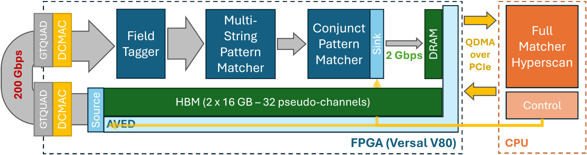
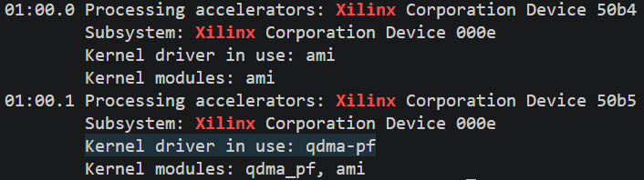

# RapidDetect on V80

Contact: [Shashank Obla](mailto:sobla@andrew.cmu.edu) (PhD Student at Carnegie Mellon University)  
A Short Paper has also been published in the FCCM 2026 Proceedings and can be found [here](./assets/FCCM_RCC_2026.pdf).

RapidDetect is an HLS-based 200Gbps (@400MHz) hardware-accelerated threat detection system for streaming, structured system logs using [Sigma](https://github.com/sigmahq/sigma) rules. This repository, prepared for the FCCM 2026 Reconfigurable Computing Challenge, contains the Vitis HLS based implementation of the full RapidDetect FPGA pipeline.

Inspired by [Pigasus Intrustion Prevention/Detection System](https://www.usenix.org/conference/osdi20/presentation/zhao-zhipeng), RapidDetect opts for a heterogeneous FPGA and CPU architecture for high-throughput, low-latency threat detection in streaming system logs. This version of the system is built for the V80 (occupying < 1 out of 3 SLRs) using AVED as a starting point and QDMA to move data and control information between the host and the FPGA. The Multi-String Pattern Matcher is capable of processing upwards of 10,000 string literals at 200Gbps (currently >4000 literals based on the ~200 Linux Sigma rules). This is followed by the Conjunct Pattern Matcher (CPM) which checks the logs that pass through the MSPM against only the rules that matched in the MSPM. Using a bloom-fliter like fingerprint, the CPM can check for conjunctions (AND) of string literals significantly reducing the false positive rate. 

At a high-level the following diagram captures the system implemented in this repository. HBM is used as a stand-in for future support for streaming inputs directly from the network using ethernet with the FPGA placed as a bump-in-the-wire.



More details on the application and the system can be found in the [System Description](./SYSTEM.md).

RapidDetect is an ongoing collaboration between [Shashank Obla](https://github.com/shashankov) and [James C. Hoe](https://users.ece.cmu.edu/~jhoe/doku/doku.php) from Carnegie Mellon University with [Tommy Tracy II](https://github.com/tjt7a), Wajih Ul Hassan and Kevin Skadron from the University of Virginia.

## Requirements

> [!NOTE]
> Only Vivado/Vitis are required to run RapidDetect in C-Simulation mode. Requires Version > 2024.2 for Python scripting support

> [!TIP]
> Make sure the submodule(s) get(s) populated using `git submodule update --init --recursive` after you clone the repo

### System Requirements (from AVED)

- RHEL 9.4 with Kernel 5.14 or Ubuntu 24.04 with Kernel 6.8

### Software Pre-requisites

- Python 3.6.8 or later (for AVED)
- Cmake 3.5.0 or later (for AVED)
- Vivado and Vitis 2025.1
- [Alveo Versal Example Design (AVED)](https://xilinx.github.io/AVED/latest/How-to%2Binstall%2Band%2Brun%2Ba%2Bpre-built%2BAVED%2Bdesign%2Bon%2Ban%2BALVEO%2Bcard.html). Make sure you [flash the pre-built design on the V80](https://xilinx.github.io/AVED/latest/AVED+Updating+FPT+Image+in+Flash.html) and install the software side AMI tool using the instructions in the link.
- [QDMA Linux Drivers](https://github.com/Xilinx/dma_ip_drivers/tree/master/QDMA/linux-kernel) is [submoduled in this repo](./dma_ip_drivers) and needs to be built and installed using the [instructions from AVED](https://xilinx.github.io/AVED/latest/AVED%2BQDMA.html) and the [QDMA Documentation](https://xilinx.github.io/dma_ip_drivers/master/QDMA/linux-kernel/html/build.html). Make sure to install both the kernel drivers and the associated apps using `sudo make install`.

> [!IMPORTANT]
> Before building the DMA drivers, add the PCIe identifier into table at end of PF section at src/pci_ids.h as described in the [Installing section](https://xilinx.github.io/AVED/latest/AVED%2BQDMA.html#installing)

### IPs for AVED

Download SMBus IP from the [Alveo V80 Accelerator Card Early Access Site](https://www.xilinx.com/member/v80.html). Copy the IP into the AVED hardware design as noted by an asterisk in the directory tree below. This step is required before building the design.

```generic
hardware
└── AVED
    └── hw
        └── amd_v80_gen5x8_25.1
            └── src
                └── iprepo
                    ├── cmd_queue_v2_0
                    ├── hw_discovery_v1_0
                    ├── shell_utils_uuid_rom_v2_0
                    └── smbus_v1_1*
```

> [!NOTE]
> You might have to request access to the site in order to get access to the SMBus IP

> [!IMPORTANT]
> Building with the SMBus IP also requires the SMBus license from the [Xilinx Product Licensing Site](https://www.xilinx.com/getlicense) once you have access to the Early Access Site

### Hyperscan Integration

Optionally you can choose to run the full system with Hyperscan integration, moving output data from the FPGA into Hyperscan running on the host. This will require some additional pre-requisites as described here:

- Hyperscan: The hyperscan repo is submoduled in this repo and must be built according to its [instructions](https://intel.github.io/hyperscan/dev-reference/getting_started.html). Some of its additional sub-requirements are (and instructions to install on Ubuntu):
    - Ragel (`sudo apt install ragel`)
    - Boost (`sudo apt install libboost-dev`)
  
  Use `./software/hyperscan/build` as the build directory to follow the standard build flow. If you use a different build directory, you will have to edit the Makefile to point to it (instructions later).

- Boost Headers: Boost is also required for shared memory communication between the FPGA host code and the Hyperscan engine. Local install is also possible as long as the boost paths are specified in the appropriate Makefiles (mentioned later in this README).
  - Boost (`sudo apt install libboost-dev`)
  - Boost Thread (`sudo apt install libboost-thread-dev`)

>[!NOTE]
> All testing for versioning was performed on Ubuntu 24.04

## How to run RapidDetect

Set up the desired version of Vitis in your environment by sourcing the settings64.(c)sh script from your Vitis install directory `source settings64.sh`

### Running C Simulation

Run the C Simulation testbench by navigating to the [`hardware`](./hardware) directory and executing the testbench python script in Vitis

```bash
cd hardware
vitis -s scripts/rapidd_testbench.py
```

This will create a `hls_workspace` folder with the Vitis workspace and the testbench. The output of the script should look like

```log
****** Vitis Development Environment
****** Vitis v2025.1 (64-bit)
  **** SW Build 6137779 on 2025-05-21-18:10:04
    ** Copyright 1986-2022 Xilinx, Inc. All Rights Reserved.
    ** Copyright 2022-2025 Advanced Micro Devices, Inc. All Rights Reserved.

Vitis Server started on port 'XXXXX'.

Running CSim for MSPM only. This can take a few minutes...
C Simulation log can be found at ./hls_workspace/smonly/smonly/logs/hls_run_csim.log
C Simulation output matches the golden output. Test PASSED.

Running CSim for full RapidDetect. This can take a few minutes...
C Simulation log can be found at ./hls_workspace/rapidd/rapidd/logs/hls_run_csim.log
C Simulation output matches the golden output. Test PASSED.
```

### Building the HLS Kernels

Similar to the C Simulation all the HLS kernels can be built using the Python [script](./hardware/scripts/rapidd_synthesis.py) as follows:

```bash
cd hardware
vitis -s scripts/rapidd_synthesis.py
```

This will create all the kernels as components in the `hls_workspace` folder as the Vitis workspace and the testbench. This might take a while. Parameterization for the kernels can be modified in the Python [script](./hardware/scripts/rapidd_synthesis.py) directly.

You can view the workspace by opening it in Vitis

```bash
vitis -w ./hls_workspace
```

### Building the AVED Design with RapidDetect

These instructions very closely follow the steps from the [AVED documentation](https://xilinx.github.io/AVED/latest/How-to%2BRebuild%2Ban%2BAVED%2BDesign%2Bfor%2BYourself.html). The scripts have been modified to point to the HLS workspace, create a block design with the RapidDetect IPs connected to AVED and appropriate changes to the build flow to allow for timing closure.

>[!TIP]
>You can change the number of parallel jobs Vivado should use based on your machine's processing power and memory availability. You can find it set to 8 in lines 43 and 45 of the [build tcl script](./hardware/AVED/hw/amd_v80_gen5x8_25.1/src/build_design.tcl) for an 8-core machine with 64GB of DRAM.

Navigate to the hardware directory and run the build_all.sh script to build the RapidDetect hardware.

```bash
cd hardware/AVED/hw/amd_v80_gen5x8_25.1
./build_all.sh
```

The build directory should contain the Vivado project. You can open this project (with the following command) to explore the Vivado Block Design for this build.

```bash
cd hardware/AVED/hw/amd_v80_gen5x8_25.1
vivado build/prj.xpr &
```

After the Vivado IDE launches with the specified project, find IP INTEGRATOR in the Flow Navigator pane, and click on “Open Block Design”.

### Programming the Design

You will use the AMI cfgmem_program command, specifying the card BDF, path to the design PDI, and which flash partition to program. In this example, the BDF is 01:00.0 (You can find the BDF of your device using this command: `lspci -k | grep -i xilinx -A 2`)

```bash
cd hardware/AVED/hw/amd_v80_gen5x8_25.1
sudo ami_tool cfgmem_program -d 01:00.0 -t primary -i ./build/amd_v80_gen5x8_25.1_nofpt.pdi -p 0
```

Successful programming is indicated by the message “OK. Image has been programmed successfully.” A hot reset is automatically performed to boot the updated design in partition 0. You can reset the PCIe and the driver using the AMI tool, and check whether the `qdma-pf` driver is loaded for the QDMA physical function using the following commands.

```bash
sudo ami_tool reload -d 01:00.1 -t driver
lspci -k | grep -i xilinx -A 2
```

You should see the following output (your BDF might be different from the 01:00.0/1 seen in this picture):


> [!NOTE]
> The QDMA physical function (PF) has the function set to 1 in the BB:DD.F number

### Building and Compiling the Host Code

> [!IMPORTANT]
> Modify the PCIe BDF for your card installation in [setup_queues.sh](./software/setup_queues.sh) and [host.h](./software/include/host.h) within the software folder. The QDMA physical function (PF) has the function set to 1 in the BB:DD.F number

Setup the QDMA queues using the setup_queues.sh script.

```bash
cd software
sudo ./setup_queues.sh
```

#### Running without Hyperscan

Build the host code using make and run it. This will run the built in test on the FPGA.

```bash
make host.x
sudo ./host.x
```

To run a real trace (the provided traces are derived from the [DARPA Transparent Computing Program](https://www.darpa.mil/research/programs/transparent-computing) generated during [Engagement #5](https://github.com/darpa-i2o/transparent-computing)), first unzip the traces in the [traces directory](./traces) and execute the host code as follows:

```bash
make -C ../traces
sudo ./host.x ../traces/E5_cadets-deduplicated.json.500k
```

Expected performance is ~172Gbps (which includes packetization overhead of splitting the log events at newlines).

> [!TIP]
> Communicating using QDMA by default requires super-user priviledges. But using udev rules, regular users can gain access to the queues directly. Create a new file as `/etc/udev/rules.d/100-v80.rules` with the line: `ACTION=="add", KERNEL=="qdma01001-MM-*", SUBSYSTEM=="qdma-pf", MODE:="666"` (replace the BBDDF number with the number for the V80 on your machine). This will set the permissions for the queues to 666 when they're created and the host code can be run without sudo.

#### Running with Hyperscan

Make sure the pre-requisites and Hyperscan are installed (including Boost). Edit the [Makefile](./software/Makefile) to point to your installation of Hyperscan and Boost if they deviate from the standard; the Makefile will find Hyperscan if built into hyperscan/build and Boost if installed system wide.

Build the host code as well as the hyperscan consumer code:

```bash
make host_producer.x
make hyperscan_consumer.x
```

Open two terminals, one to run the producer and one for the consumer. With the FPGA programmed with the bitstream (using the prior instructions) run the following commands. Use the number of threads based on your machine and make sure its consistent between the two commands.

```bash
# Terminal 1 (run first)
sudo ./host_producer ../traces/E5_cadets-deduplicated.json.500k <num_threads>

# Terminal 2 (looks for the shared memory region created by the producer)
sudo ./hyperscan_consumer patterns_full.db <num_threads>
```

You should see a new file [all_detections.log](./software/all_detections.log) which contains the subset of events that passed through both the FPGA and Hyperscan and are flagged as malicious by RapidDetect. The performance of this implementation needs to be tuned to a new machine setup and you might not see the full bandwidth if you do not have enough cores (for this given trace you might need upwards of 24 cores for Hyperscan to handle the rate coming from the FPGA).
