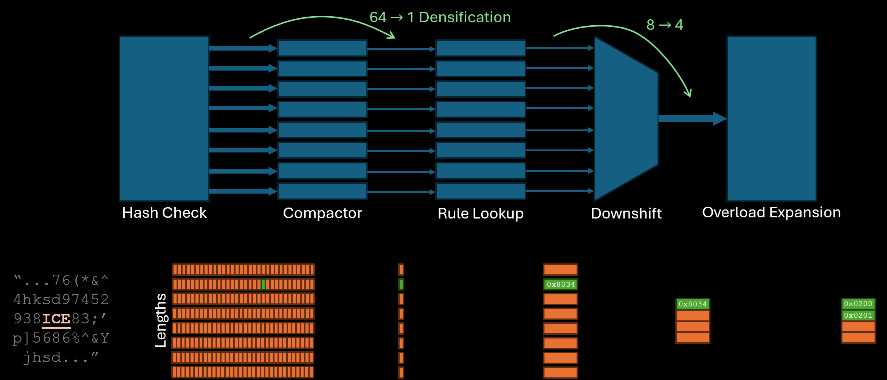
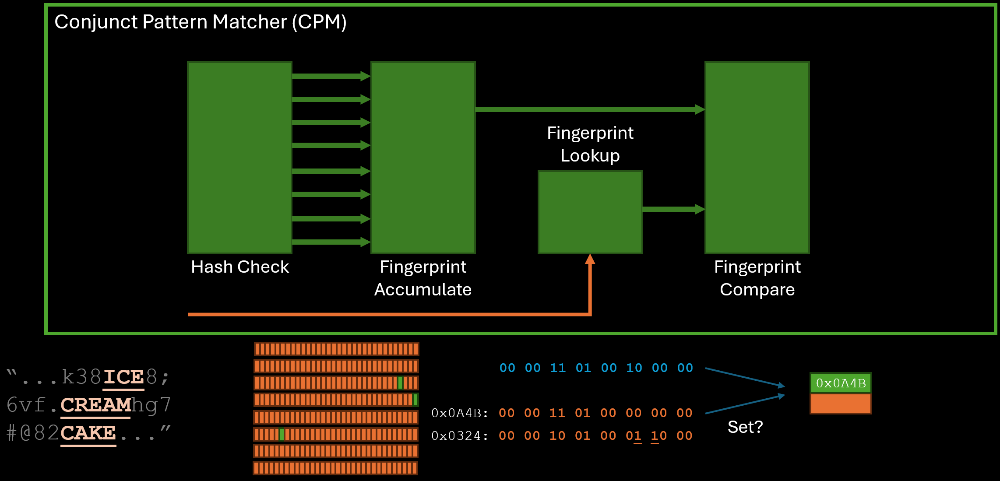

# RapidDetect System Description

Here, we present an overview of RapidDetect with the aim of matching all [200 Linux Sigma rules](https://github.com/SigmaHQ/sigma/tree/master/rules/linux) with sub-second latency while maintaining a 200 Gbps log traffic throughput on a single server. The system design ensures that we detect threats within the log data before it is ingested into a database, thereby removing the overhead of data ingestion typically associated with database tools like Elasticsearch. The RapidDetect system is based on two components of the [Pigasus](https://www.usenix.org/conference/osdi20/presentation/zhao-zhipeng) system that we optimized for log processing: the Multi String Pattern Matcher (MSPM) and the Conjunct Pattern Matcher (CPM). 

The MSPM scans packet payloads at line rate for many thousands of fast-patterns concurrently and reports the rule ID (and optionally the position) of the patterns detected for a packet. The MSPM removes a large fraction of incoming traffic that does not match any rules and the rest of the match traffic is input into the CPM. The CPM performs more selective checks (conjuction of literals per rule) but only for the rules that matched in the MSPM significantly reducing the complexity and volume of the rule checking needed.

Finally, we use the CPU regular expression engine [Hyperscan](https://github.com/intel/hyperscan) to process all events flagged by the FPGA to remove any false positives. Our experiments showed that for the 200 Linux Sigma rules we used for evaluation, Hyperscan running on a 16-core CPU can process up to 5.76 Gbps of log bandwidth. The purpose of the FPGA frontend is to be selective enough to reduce the full line-rate traffic (e.g. 200 Gbps) down to less than 5.76 Gbps to enable complete log processing in a single server.

RapidDetect introduces novel FPGA-related features:

1. **Field Tagger:** a novel component that checks field-specific literals on JSON structured logs, reducing false positives unavoidable in existing bytestream-oriented accelerators that match literals without field qualification
2. **Modified Multi-String Pattern Matcher** that handles a one-to-many mapping between fast patterns and rule conjunctions, a departure from the one-to-one correspondence assumed by existing bytestream-oriented accelerators, along with a scheme for selecting fast patterns for Sigma rules that lack natural fast patterns
3. **HLS Implementation** allows RapidDetect to be much more parametrizable and configurable that the original rigid RTL implentation of Pigasus. A wealth of parameters are available to customize the hardware kernels to suit new rules or logs for string matching.

## Field Tagging

Before packets are matched for string patterns, the Field Tagger processes the JSON format to tag the value in a `"field": "value"` pair to belong to the field. This optimization is particularly useful for logs which might only a handful of fields and rules might require checking of literals within specific fields. For example, the rule: the value for field `"path"` must contain `"/.cache/"` somewhere in it, would not representatable as a single literal without losing the field literal, reducing selectivity.

## Multi-String Pattern Matcher

The core operation performed by MSPM is string matching on Fast Patterns, with each rule allowed to specify one literal as its "Fast Pattern". The design is derived from Section 6.3.1 of [Zhipeng Zhao's PhD Thesis](https://users.ece.cmu.edu/~jhoe/distribution/2021/zhao.pdf).

1. The first stage (mspmHashCheck) scans the input byte stream at line rate. At 64 bytes per cycle (@400MHz = 200Gbps), Stage 1 produces up 512 detections per cycle. (That is, whether a length 2, 3, 4, 5, 6, 7, 8a and 8b pattern ends on each of the 64 positions. There are many more length 8 patterns so they are divided into 2 independent detection buckets 8a and 8b)

2. A compactor module sits between the first and third stages to coalesce the wide, sparse output of valid hits from Stage 1 into the narrower processing width of Stage 3.

3. The third stage looks up the RIDs corresponding to the detection hits. Stage 3 can process N hits per cycle for each pattern-length bucket. N is tunable. (In Pigasus N is set to 1. While Stage 1 could produce upto 512 hits in a cycle on some inputs, we expect on average to encounter less than 1 hit per pattern-length bucket per cycle.)

4. In addition to the core MSPM algorithm stages, there are 2 optional stages to manipulate the output as necessary. Stage 4 (Recombine) merges the detections looked up by pattern length into a single stream, preserving the packet boundaries. The stream can carry upto 8*LOOKUP_WIDTH number of hits per cycle (up to LOOKUP_WIDTH hits per length). If the above stream is to sparsely utilized, an optional "downshift stage" can compact the above stream into a narrow width.

5. Some string pattern sets result in collisions in the hash table. In this case, an "overloaded" RID is stored in the hashtable and needs to be expanded into raw RIDs in a separate step. This can be done in HW in an optional stage.

### Compactor

The [compactor](./hardware/include/utils/compactor.h) is designed as a reduction tree of tasks and composed in a parametrizable fashion using template specialization based recursion in HLS. This causes C Simulation to launch a large number of threads (one per 2-to-1 compactor task), which only completes in reasonable time for smaller widths of the design (set to 50Gbps in the testbench script).

## Conjunct Pattern Matcher

While the MSPM in itself can filter a significant fraction of the traffic, rules often contain more than one string literal that cannot be completely captured using a single "Fast Pattern" leading to false positives. Depending the input logs and the ruleset this could lead to enough traffic to bottleneck the CPU full matcher stage. The CPM aims to further reduce the traffic needing full matching. The design is derived from Section 6.3.3 of [Zhipeng Zhao's PhD Thesis](https://users.ece.cmu.edu/~jhoe/distribution/2021/zhao.pdf).

1. The CPM uses a very similar front-end to MSPM, starting with a Hash Check stage which behaves exactly as the MSPM Hash Check stage albeit parameterized to a much lower throughput (only to serve the filtered traffic after the MSPM) and potentially matching more literals than the MSPM (multiple literals per rule as opposed to a single literal per rule in the MSPM).

2. Since the matches encode each individual string literal, checking the conjuction across these matches for each rule can be very complex. The CPM opts for a bloom-filter like fingerprint approach where all the matches are reduced into a single fingerprint per packet. The second stage directly combines all the matches into a fingerprint without the need for compaction.

3. For each rule emitted by the MSPM, the CPM first looks up the rule's fingerprint and then performs a subset match with the fingerprint generated for the packet. Absence of a match confirms that the packet does not match the particular rule (there are no false negatives in the RapidDetect pipeline). The comparison can be paramaterized to check multiple rules (NF_METAIN_WIDTH) per cycle.

4. Packets without any rule matches at the end of the CPM can be safely discarded while the rest of the packets including any false positives can move on to the next stage.

## Hyperscan

Finally Hyperscan filters the already filtered down traffic output from the FPGA design to remove as false positives by checking all the rules exactly. The packets are first moved to the host using DMA with Hyperscan running multi-threaded on the Host CPU. The host code processes the data and uses shared memory based communication to move the data to the Hyperscan worker threads.
